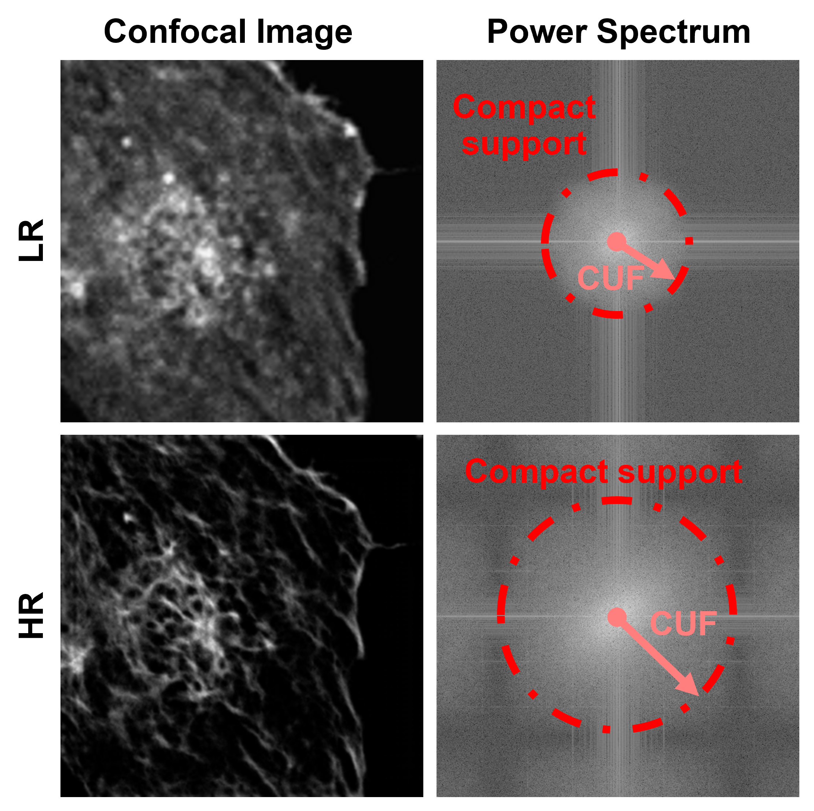

## CycleGAN for Confocal Microscopy Image Translation

# Overview:

This repository hosts Python scripts implementing a CycleGAN (Cycle-Consistent Generative Adversarial Network) for translating images within experimental confocal microscopy dataset. The CycleGAN architecture consists of two generators and two discriminators trained to transform images between different domains of confocal microscopy data. The goal is to enhance image quality and extract meaningful features for analysis.

# Key Features:
Model Architecture: Utilizes TensorFlow and Keras to define CNN-based generators and discriminators. Includes instance normalization, residual blocks (resnet blocks), and custom loss functions (adversarial and perceptual losses) to optimize image translation performance.

# Training Process: 
Alternates between updating discriminators and generators based on adversarial loss and cycle-consistency loss. Provides utilities for visualizing training progress, saving models, and evaluating metrics such as PSNR and SSIM.

# Dataset Handling: 
Loads and preprocesses training and validation datasets (confocal_exper_altogether_trainR_256.npz, confocal_exper_non_sat_filt_validR_256.npz, confocal_exper_paired_filt_validsetR_256.npz). Ensures compatibility with TensorFlow/Keras requirements for efficient training.

# Utilities: 
Includes functions for image pooling, performance summarization (summarize_performance), and model checkpointing (save_models). Facilitates seamless integration into existing deep learning workflows.

# Usage:
Clone or fork the repository to your local environment.
Customize dataset paths and filenames as per your specific dataset organization and naming conventions.
Execute the scripts in a suitable Python environment with GPU support for accelerated training.

# Requirements:
Python 3.x, TensorFlow 2.x, NumPy, Matplotlib, TensorFlow Addons.

# Benefits:
Enables researchers and developers in the field of confocal microscopy to apply state-of-the-art deep learning techniques for image enhancement and analysis.
Facilitates experimentation and adaptation of CycleGAN models for diverse microscopy imaging tasks, promoting advancements in biomedical image processing.

# Contributions:
Contributions, issues, and feature requests are welcome. Please follow the repository's guidelines for pull requests and code contributions.
For major changes or enhancements, kindly open an issue first to discuss the proposed modifications.

# Authors:
Dr. Ana Doblas and Dr. Carlos Trujillo (Universidad EAFIT): Developers

Dr. Thompson and Dr. Skalli: Biological Experts

C. Trujillo,1 L. Thompson,2 O. Skalli,2 and A. Doblas3,*

1School of Applied Sciences and Engineering, Universidad EAFIT, Medellín, 050027, Colombia.
1Department of Biological Sciences, University of Memphis, Memphis, TN 38152, USA
3Department of Electrical and Computer Engineering, University of Massachusetts Dartmouth, MA 02747, USA
*Corresponding authors: catrujilla@eafit.edu.co, adoblas@umassd.edu

# How to Cite

If you use this code or find our work helpful in your research, please cite our publication:

Carlos Trujillo, Lauren Thompson, Omar Skalli, and Ana Doblas, "Unpaired data training enables super-resolution confocal microscopy from low-resolution acquisitions," Opt. Lett. 49, 5775-5778 (2024).
https://doi.org/10.1364/OL.537713

# License:
This project is licensed under the MIT License, ensuring openness and accessibility for academic and research purposes.
